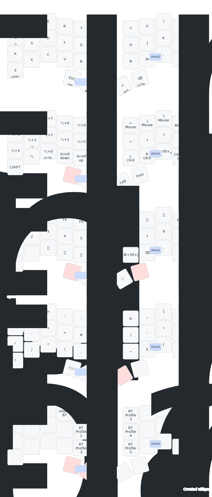

# Urchin ZMK Firmware

This is a custom keymap firmware for the [Urchin Keyboard](https://github.com/duckyb/urchin), built with support for the **latest ZMK main branch** (Zephyr 3.5+).

## Keymap Layout

  

### Layout Context & Features

This layout is highly customized for a macOS power-user workflow:

* **Aerospace Integration:** You will notice `Alt + Num` (e.g., `LA(1)`, `LA(2)`) on many keys in the Nav layer. These are specifically mapped to control **[AeroSpace](https://github.com/nikitabobko/AeroSpace)**, a macOS tiling window manager, allowing for instant workspace switching directly from the keyboard.
* **Mac-Specific Shortcuts:** 
  * `Cmd + Shift + J` (`LG(LS(J))`) is mapped on the Numpad layer for instantly triggering the **Homerow** app.
  * `Alt + D` is mapped on the Nav layer for quickly launching **Raycast**.
  * Native macOS media controls (Brightness, Volume, Play/Pause, Prev, Next).
* **Ergonomic Modifiers:** `mt_tap LALT` on `Q`, `mt_rep LSHFT` on `Z`, and a custom `mt_tap LCTRL` tucked onto the Nav layer's `C` key for easy one-handed mouse zooming.
* **ZMK Pointing:** Full mouse keys support (mouse movement, scrolling, and clicking) using the new ZMK pointing subsystem.

## Getting started

**Are you trying to make your own ZMK firmware?**  
[Here are the steps you need to take.](./GETTING_STARTED.md)

**Do you want to edit this layout diagram?**  
You can edit the `keys.drawio.xml` file in this repository using Draw.io to visually update your layout diagram.
